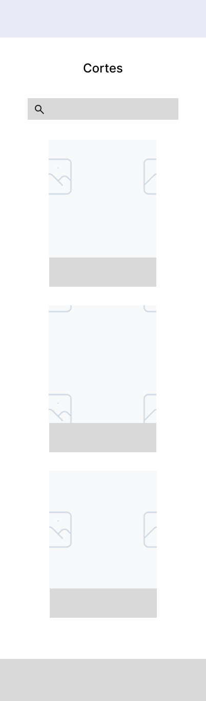
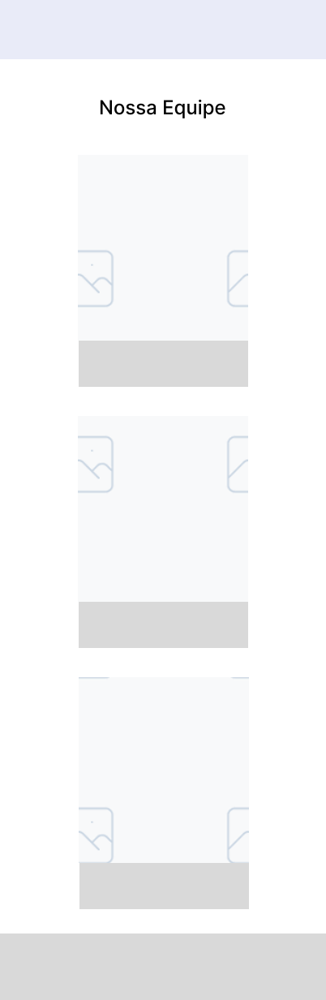

# El Patron — Next.js Migration

## Integrantes

| Nome | RA |
| ---- | -- |
| Gustavo Garabetti Munhoz | 10409258 |
| João Pedro Rodrigues Vieira | 10403595 |
| Joaquim Rafael Mariano Prieto Pereira | 10408805 |
| Caio Yukio Yazawa | 10418604 |
| Erick Guilherme de Macedo Cabral | 10419996 |

---

## Processo de Ideação — Migração para Next.js

### Contexto

O projeto original **El Patron WebApplication** foi desenvolvido como uma landing page estática usando HTML, CSS e JavaScript puro. A aplicação cumpriu bem seu papel inicial: apresentar a barbearia ao público, exibir serviços, galeria de estrutura, formulário de contato e localização.

Com a evolução do projeto, identificamos limitações claras na abordagem estática:

| Limitação do projeto original | Impacto |
| ----------------------------- | ------- |
| Sem roteamento — tudo em uma única página | Navegação limitada, difícil de escalar |
| Dados estáticos no HTML | Impossível atualizar conteúdo sem mexer no código |
| Sem back-end | Formulário salva apenas no localStorage, sem persistência real |
| Sem catálogo de cortes dinâmico | Não existe uma forma estruturada de exibir os tipos de corte oferecidos |

A migração para **Next.js** resolve essas limitações ao introduzir roteamento baseado em arquivos, consumo de API externa, renderização híbrida (SSG + SSR) e uma base de código moderna e escalável.

---

### Decisões de Arquitetura

A nova aplicação adota o **App Router** do Next.js 16, com o código-fonte organizado sob `src/app`. As páginas estáticas são pré-renderizadas em build time, enquanto a tela de cortes consumirá dados em runtime via API externa.

**Stack escolhida:**

- **Next.js 16** com App Router (estrutura `src/app`)
- **React 19**
- **JavaScript** puro (sem TypeScript)
- **CSS3** na estilização (`globals.css`)
- **hairstyle-api** como back-end externo — desenvolvida pelo integrante Gustavo Garabetti em Clojure, responsável por armazenar e disponibilizar os tipos de corte ([repositório](https://github.com/ggarabs/hairstyle-api))

---

### Novas Telas e Mudanças Principais

#### 1. Tela de Listagem de Cortes — `/cortes`

Catálogo com todos os tipos de corte oferecidos pela barbearia, a ser alimentado pela **hairstyle-api**. Exibe os cortes em cards, cada um com nome, imagem e preço. Ao clicar em um card, o usuário é levado à página de detalhe do corte correspondente. Atualmente a tela já apresenta o layout final — grade responsiva (cards em coluna no mobile e em grid no desktop) e campo de busca como _stub_ visual — populada com cortes de exemplo, aguardando a integração com a API.

#### 2. Tela Dinâmica de Detalhe — `/cortes/[hairstyle-id]`

Página individual de cada corte, acessada a partir da listagem. Exibe nome, descrição, imagem e tags do corte selecionado — preço e duração estimada serão acrescentados junto com a integração da API. A página 404 customizada já está implementada via `not-found.jsx` no mesmo segmento dinâmico: ao acessar um id inexistente, a aplicação responde com HTTP 404 e renderiza uma tela com mensagem amigável e botão de retorno ao catálogo. No estado atual, a rota dinâmica trabalha com um conjunto fixo de cortes de exemplo, pronta para receber os dados vindos da API.

#### 3. hairstyle-api

API externa desenvolvida em **Clojure** por Gustavo Garabetti, responsável por armazenar e disponibilizar os tipos de corte oferecidos pela El Patron. A aplicação Next.js consome essa API via `fetch`. Os endpoints disponíveis serão documentados conforme a API evolui.

Repositório: [github.com/ggarabs/hairstyle-api](https://github.com/ggarabs/hairstyle-api)

#### 4. Tela Estática da Equipe — `/equipe`

Página dedicada aos profissionais da El Patron, inexistente no projeto original. Será completamente estática e pré-renderizada em build time. Cada membro exibirá: nome, especialidade, tempo de casa, foto e link para Instagram (opcional). Atualmente a tela já apresenta o layout final, reutilizando a mesma estrutura de cards da listagem de cortes, e exibe membros de exemplo (nome e especialidade). Os dados definitivos da equipe e o link para Instagram serão preenchidos em uma próxima iteração.

---

### Estrutura de Rotas

```DIG
src/app/
├── layout.jsx                 → Layout raiz (header, footer, metadata)
├── globals.css                → Estilos globais portados do projeto original
├── Hamburger.jsx              → Botão da navbar mobile (client component)
├── page.jsx                   → Home (landing page original)
├── equipe/
│   └── page.jsx               → Tela estática da equipe
└── cortes/
    ├── page.jsx               → Catálogo de cortes
    └── [hairstyle-id]/
        ├── page.jsx           → Detalhe dinâmico de um corte
        └── not-found.jsx      → Página 404 customizada do segmento dinâmico
```

---

### Status de Implementação

| Tela / Rota | Status |
| ----------- | ------ |
| `/` — Home (landing page) | Migrada do projeto original, mantendo o comportamento de DOM/`localStorage` |
| `/cortes` — Listagem | Layout final implementado, com cortes de exemplo, grade responsiva e campo de busca como _stub_; integração com a API pendente |
| `/cortes/[hairstyle-id]` — Detalhe | Implementada com conteúdo de exemplo (nome, descrição, imagem e tags); página 404 customizada (`not-found.jsx`) ativa; consumo da API pendente |
| `/equipe` — Equipe | Layout final implementado, com membros de exemplo (nome e especialidade); dados definitivos e link para Instagram pendentes |
| `hairstyle-api` | Em desenvolvimento no repositório externo; endpoints serão documentados conforme evoluem |

---

## Protótipo — Wireframes

### Tela de Listagem de Cortes — `/cortes`



---

### Tela de Detalhe do Corte — `/cortes/[hairstyle-id]`


---

### Tela da Equipe — `/equipe`


