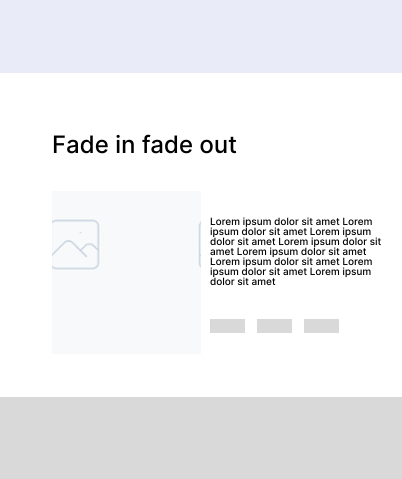

# El Patron — Next.js Migration

## Integrantes

| Nome | RA |
|---|---|
| Gustavo Garabetti Munhoz | 10409258 |
| João Pedro Rodrigues Vieira | 10403595 |
| Joaquim Rafael Mariano Prieto Pereira | 10408805 |
| Caio Yukio Yazawa | 10418604 |
| Erick Guilherme de Macedo Cabral | 10419996 |

---

## Processo de Ideação — Migração para Next.js

### Contexto

O projeto original **El Patron WebApplication** foi desenvolvido como uma landing page estática usando HTML, CSS e JavaScript puro. A aplicação cumpriu bem seu papel inicial: apresentar a barbearia ao público, exibir serviços, galeria de estrutura, formulário de contato e localização.

Com a evolução do projeto, identificamos limitações claras na abordagem estática:

| Limitação do projeto original | Impacto |
|---|---|
| Sem roteamento — tudo em uma única página | Navegação limitada, difícil de escalar |
| Dados estáticos no HTML | Impossível atualizar conteúdo sem mexer no código |
| Sem back-end | Formulário salva apenas no localStorage, sem persistência real |
| Sem catálogo de cortes dinâmico | Não existe uma forma estruturada de exibir os tipos de corte oferecidos |

A migração para **Next.js** resolve essas limitações ao introduzir roteamento baseado em arquivos, consumo de API externa, renderização híbrida (SSG + SSR) e uma base de código moderna e escalável.

---

### Decisões de Arquitetura

A nova aplicação adota o **App Router** do Next.js 14+. As páginas estáticas são pré-renderizadas em build time, enquanto a tela de cortes consome dados em runtime via API externa.

**Stack escolhida:**

- **Next.js 14+** com App Router
- **JavaScript** puro (sem TypeScript)
- **CSS3** na estilização
- **hairstyle-api** como back-end externo — desenvolvida pelo integrante Gustavo Garabetti em Clojure, responsável por armazenar e disponibilizar os tipos de corte ([repositório](https://github.com/ggarabs/hairstyle-api))

---

### Novas Telas e Mudanças Principais

#### 1. Tela de Listagem de Cortes — `/cortes`

Catálogo com todos os tipos de corte oferecidos pela barbearia, alimentado pela **hairstyle-api**. Exibe os cortes em cards, cada um com nome, imagem e preço. Ao clicar em um card, o usuário é levado à página de detalhe do corte correspondente.

#### 2. Tela Dinâmica de Detalhe — `/cortes/[slug]`

Página individual de cada corte, acessada a partir da listagem. Exibe todas as informações do corte selecionado: nome, descrição, preço, duração estimada e imagem. Caso o slug não exista, o usuário é direcionado para uma página 404 customizada.

#### 3. hairstyle-api

API externa desenvolvida em **Clojure** por Gustavo Garabetti, responsável por armazenar e disponibilizar os tipos de corte oferecidos pela El Patron. A aplicação Next.js consome essa API via `fetch`. Os endpoints disponíveis serão documentados conforme a API evolui.

Repositório: [github.com/ggarabs/hairstyle-api](https://github.com/ggarabs/hairstyle-api)

#### 4. Tela Estática da Equipe — `/equipe`

Página dedicada aos profissionais da El Patron, inexistente no projeto original. É completamente estática e pré-renderizada em build time. Cada membro exibe: nome, especialidade, tempo de casa, foto e link para Instagram (opcional).

---

### Estrutura de Rotas

```
app/
├── page.jsx                   → Home (landing page original)
├── equipe/
│   └── page.jsx               → Tela estática da equipe
└── cortes/
    ├── page.jsx               → Catálogo de cortes
    └── [slug]/
        └── page.jsx           → Detalhe dinâmico de um corte
```

---

## Protótipo — Wireframes

### Tela de Listagem de Cortes — `/cortes`


---

### Tela de Detalhe do Corte — `/cortes/[slug]`



---

### Tela da Equipe — `/equipe`


